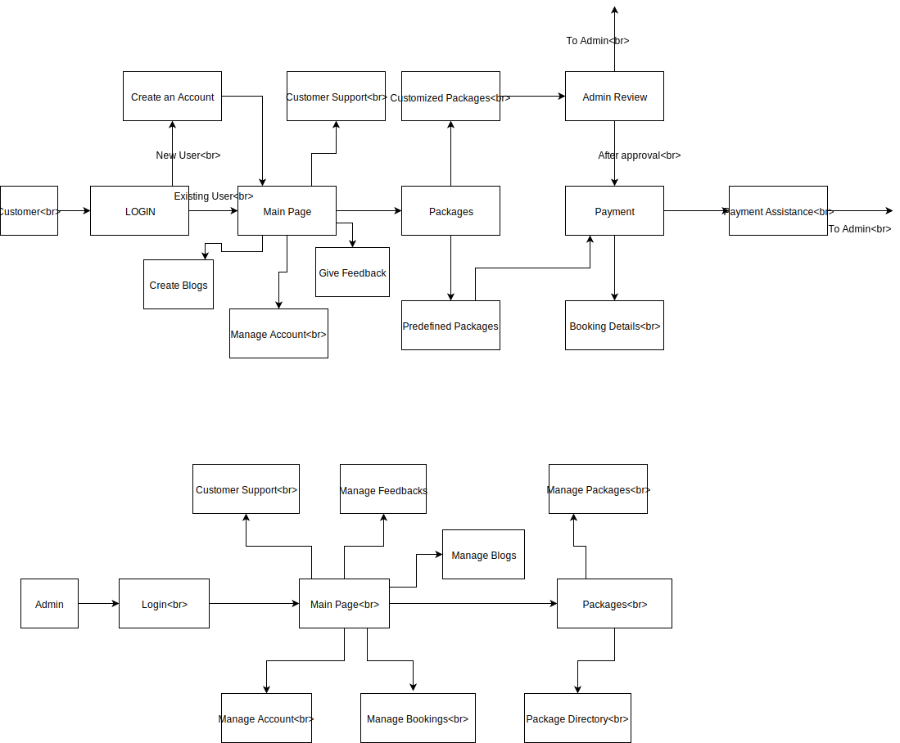

<h1>Backpackers Travel Application</h1>
<h2>USER STORIES</h2>
<h3>ADMIN</h3>
<table>
 <th>USER STORY</th>
 <th>ACCEPTANCE CRITERIA</th>
 <tr><td>Admin should be able to see the login portal to get access to the website control.</td>
   <td>Username field, password field and Login button should appear on the login screen.   
   Admin should be navigated to the admin home page after successful login.</td></tr>

<tr> <td> 
Admin should be able to see the ‘Manage About Us’ button. </td>
  <td> 
Admin should be able to create, read, update and delete the website details in the About us page.</td>
  </tr>

<tr> <td>
Admin should be able to see the ‘Manage Blogs’ button. </td>
  <td>
Admin should be able to see create blog button and approve blogs button.    
Admin should be able to see Blog title field, Blog content field and image uploader on clicking create blog button.   
Admin should be able to see Blog title field, Blog content field and image uploader on clicking create blog button.  
Admin should be able to see a table with the Blog title, blog content and images uploaded by customers for approval.  
Admin should be able to approve the blog after verification and it should appear on the website’s blog portal. </td> </tr>
  
  <tr> <td> 
Admin should be able to see the ‘Manage Feedbacks’ button.</td>
  <td>Admin should be able to see all the feedbacks provided by the customers in a table.   

Admin should be able to approve the feedback and approved feedbacks should appear on the feedbacks portal.  </td> </tr>
  
  <tr> <td>
Admin should be able to see the ‘Manage Enquiries’ button. </td>
  <td> 

Admin should be able to see all the enquiries sent by the customers in a table with a reply button for each.   

Admin should be able to respond to the enquiries through the reply button in a mail to the customer. </td> </tr>

<tr> <td> 
Admin should be able to see the ‘Manage Bookings’ button.</td>
  <td>
Admin should be able to see all the bookings done by the customers in a table.    

Admin should be able to cancel the booking and the customer should be sent a mail about cancellation of booking.</td> </tr>

<tr> <td>

Admin should be able to see the “Create Package’ button. </td>
  <td>

Admin should be able to see source, destination, price, itinerary and image uploader fields.   
Admin should be able to create a package after filling all the fields. </td> </tr>

<tr> <td> Admin should be able to see the ‘Manage Packages’ button.</td>
  <td> 

Admin should be able to see a list of existing packages in a table.   

Admin should be able to edit a package by clicking on edit button for each package. </td> </tr>
  
  
  <tr> <td>
Admin should be able to see the ‘Package Requests’’ button. </td>
  <td> 
Admin should be able to see all the package requests made by the customers in a table.   

Admin should be able to approve the package request by clicking on approve button for each request.</td> </tr>
  
</table>

<h3>CUSTOMER</h3>

<table>
  <th>USER STORY</th>
  <th>ACCEPTANCE CRITERIA</th>
  
  <tr>
  <td>
    Customer should be able to see the login portal to get access to the website
  </td>
  <td>
    Username field, password field and Login button should appear on the login screen 
    Customer should see the option to register if account is not created 
    Customer should see the link to login through Facebook or Google 
    Customer should be navigated to the homepage after successful login 
    Customer should be able to view, update, and delete his profile 
  </td>  
  </tr>
  
  <tr>
  <td>
    Customer should be able to see the ‘About Us’ button
  </td>
  
  <td>
    Customer should be able to read website details in the About us page
  </td>
  </tr>
  
  <tr>
  <td>
    Customer should be able to see the ‘Blogs’ button
  </td>
  
  <td>
    Customer should be able to see existing blogs on the website 
    Customer should be able to see create blog button 
    Customer should be able to see Blog title field, Blog content field and image uploader on clicking create blog button 
  </td>
  </tr>
  
  <tr>
  <td>
    Customer should be able to see the ‘Feedbacks’ button
  </td>
  
  <td>
    Customer should be able to see all the feedbacks provided by other customers  
    Customer should be able to submit a feedback which would appear on the screen after admin approval 
  </td>
  </tr>
  
  <tr>
  <td>
    Customer should be able to see the ‘Enquiries’ button
  </td>
  
  <td>
    Customer should be able to see a name, email, contact number, enquiry field and submit button to send enquiry to the admin 
  </td>
  </tr>
  
  <tr>
  <td>
    On the homepage, customer should be able to see the destination and budget textbox

  </td>
  
  <td>
   Customer should be able to search for the particular destination packages if available
</td>
  </tr>
  
   <tr>
  <td>
   Customer should be able to see the available packages on the homepage
  </td>
  
  <td>
   Customer should be able to select any available package and continue with the booking
</td>
  </tr>
  
  <tr>
  <td>
   Customer should be able to see the button for custom packages
</td>
  
  <td>
   Customer should be able to see a source, destination, budget, duration fields and submit button to send the request for custom packages, which will be confirmed after admin approval
</td>
  </tr>
  
  <tr>
  <td>
   Customer should be able to manage cart
</td>
  
  <td>
  
Customer should be able to view, add, update and delete multiple packages from the cart

</td>
  </tr>
  
  
   <tr>
  <td>
   
Customer should be able to make the payment
</td>
  
  <td>
  
Customer should be able to confirm booking only upon logging in.
Customer should be able to make payment through the given payment methods i.e., Credit/Debit
Customer should receive an email after booking confirmation

</td>
  </tr>
  
  <tr>
  <td>
   Customer should be able to see the ‘Manage Bookings’ button
</td>
  
  <td>
  
Customer should be able to see all his booking history in a table
Customer should be able to cancel the booking and the admin would  receive an email about cancellation of booking

</td>
  </tr>
  
  
</table>

<h1> Technologies and Frameworks </h1>
   <table>
    <tr>
     <td> Angular6 </td>
     <td> SCSS </td>
     <td> MongoDB </td>
     <td> NodeJS with ExpressJS </td>
     <td> Bootstap v4.1.3 </td> 
    </tr>
</table>

<h2> Installation </h2>
<ul>
 <li> Install all dependencies in package.json file. </li>
<li> This can be done by navigating to the root directory in the command line interface and running the following command: 
 $ npm install $ npm angular- material </li>
<li> Next, install all of the Angular 5 development dependencies in package.json file:
$ cd Travel-app - frontend

<li> Add the npm install as required : $ npm install </li>
<li> Install all of the server dependencies in package.json file:
 $ cd Travel-app - backend

<li> Add the npm install as required : $ npm install </li> 
<li> $ npm install express --save </li>
<li> $ npm install mongoose </li>
<li> After all the installation is complete, navigate to the root directory and then: Production
<li> In root directory(in Travel-app - backend)run : $ npm run start
<li> Access production server at: http://localhost:3000/api </li>

Development
<li> $ cd client/ $ ng serve --open 
<li> In another window, from root directory run: $ npm start </li>
<li> Access development server at: http://localhost:4200 </li> 
<li> Access API at: http://localhost:3000/api </li> 
</ul>
 
Contributers : Team CodeBlue
 
 
